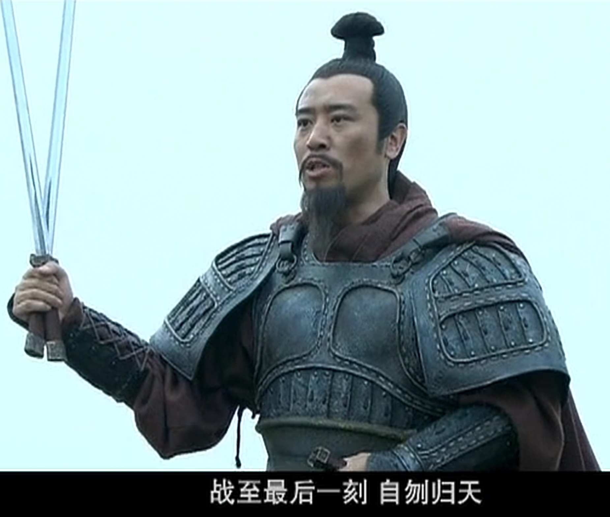

# 新三国（首播版）字幕数据集



《新三国》首播版全 95 集字幕收录，共 **57,586 条**，每条字幕均带**集数**与**时间戳**。

数据由 [chr431/video_subtitle_extractor](https://github.com/chr431/video_subtitle_extractor)
自动生成，底层使用自制高性能解码 + OCR 并行引擎
[chr431/video_ocr_engine](https://github.com/chr431/video_ocr_engine)；
在 RTX 4060 Laptop（NVDEC + TensorRT）上全片识别仅需约 **1 小时**。

> 视频资源来自网络，仅供学习、交流与研究使用。请尊重原片版权，勿用于商业用途。

---

## 数据格式

`subtitles.csv` 为 UTF-8（带 BOM）CSV，三列：

| 列名 | 说明 | 示例 |
|---|---|---|
| `video` | 视频文件名（集数） | `新三国05.mkv` |
| `time_hms` | 字幕出现时间，`HH:MM:SS` | `0:07:39` |
| `text` | OCR 字幕原文 | `你走了我们吃什么` |

```csv
video,time_hms,text
新三国01.mkv,0:00:04,东汉末年
新三国01.mkv,0:00:07,黄巾起义在爆发后的第八个月
新三国01.mkv,0:00:10,即告平息
```

### 数据统计

| 项目 | 值 |
|---|---|
| 集数 | 95（新三国01.mkv ~ 新三国95.mkv） |
| 字幕条数 | 57,586 |
| 时间格式 | `HH:MM:SS` |
| 生成后端 | NVDEC 硬解 + TensorRT OCR |
| 生成耗时 | 约 1 小时（RTX 4060 Laptop） |

## 为什么是首播版？

首播版字幕背景全黑，**识别准确率高**。若使用重制版，字幕叠加在画面背景上，
会产生大量噪声，难以通过简单规则滤除。

## 已知限制

- 当前无法识别对话中的**空格和标点**，也无法仅凭字幕判断说话者，还望列位诸公见谅。
- OCR 结果可能存在少量同音/形近字误差（可在使用前自行校对）。

## 经典台词节选

```
新三国05.mkv,0:07:39,你走了我们吃什么
新三国05.mkv,0:07:42,吃什么是啊是啊

新三国20.mkv,0:23:00,风从虎云从龙
新三国20.mkv,0:23:03,龙虎英雄傲苍穹

新三国20.mkv,0:28:28,你的兵器不是双股剑吗
新三国20.mkv,0:28:30,在我看来
新三国20.mkv,0:28:32,一把叫仁之剑
新三国20.mkv,0:28:35,一把叫义之剑

新三国36.mkv,0:41:54,列位弟兄随我接战
新三国36.mkv,0:41:57,战至最后一刻自刎归天

新三国45.mkv,0:01:28,记住不要愤怒
新三国45.mkv,0:01:30,愤怒会降低你的智慧

新三国52.mkv,0:09:29,龙可是帝王之征啊

新三国52.mkv,0:40:45,这江东到底你是主
新三国52.mkv,0:40:49,还是我是主

新三国93.mkv,0:34:31,好火啊比彝陵之火还好啊
```

## 使用示例

```python
import csv

with open("subtitles.csv", encoding="utf-8-sig", newline="") as f:
    rows = list(csv.DictReader(f))

# 查看某集的字幕
episode = [r for r in rows if r["video"] == "新三国01.mkv"]
print(len(episode), episode[:3])
```

## 版权与免责声明

- 字幕数据来源于电视剧《新三国》，**版权归原权利方所有**；本仓库仅作学习、交流、备份用途。
- 请勿将本数据集用于商业用途或进行盈利性传播。
- 若权利人认为本仓库内容构成侵权，请联系删除。

## 许可证

- 本仓库的说明文档与整理内容：见 [LICENSE](LICENSE)。
- 字幕数据本身适用上方版权声明（第三方版权，不随仓库 LICENSE 授权）。
